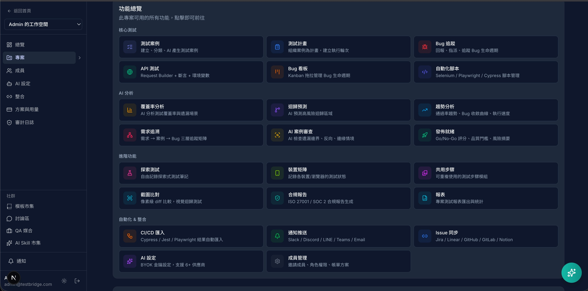

# TestBridge

QA 工程師的繁中社群 + 測試管理工具。

**網站**：[testbridge.chenjundigital.com](https://testbridge.chenjundigital.com)

---

## 這是什麼

TestBridge 是一個給台灣 QA 工程師用的平台，目前有三個部分：

1. **QA 社群** — 討論測試策略、分享經驗、匿名發文（已上線）
2. **AI Skill 市集** — 19 個專業 QA Prompt，一鍵複製或下載 Markdown（已上線）
3. **測試管理工具** — 20 個功能模組，案例管理到發佈評分全包（開發完成，Q3 2026 上線）

## 社群功能（已上線）

不用登入就能瀏覽，匿名也能發文。

- **討論區** — 聊測試策略、自動化、Bug 經驗、職涯、工具推薦
- **AI Skill 市集** — 19 個場景化 QA Prompt（電商金流、API 安全、Mobile、效能、無障礙、醫療、K8s…）
- **測試模板** — 社群共享的測試案例模板，CSV 格式可直接匯入

## 測試管理功能（開發中，Q3 2026）

完整功能列表：

### 核心測試
- 測試案例管理（資料夾分類、CSV 匯入匯出、AI 自動生成）
- 測試計畫 + 執行輪次（TestRun）
- Bug 追蹤（建立、附件上傳、狀態流、指派）
- Bug Kanban 看板（HTML5 拖拉換狀態）
- API 測試（類似 Postman，7 種 HTTP 方法、斷言、環境變數）
- 自動化腳本管理（Selenium JS/Python/Java、Playwright、Cypress、Appium）

### AI 分析
- AI 覆蓋率分析 — 找出測試遺漏的場景
- AI 迴歸預測 — 推薦應該優先測試的項目
- AI 案例審查 — 檢查邊界 / 反向 / 邊緣情境遺漏
- AI Bug 重複偵測 — 建立 Bug 時即時比對
- AI Bug 輔助填寫 — 根據標題自動建議嚴重度和重現步驟

### 進階功能
- 需求追溯矩陣（需求 → 測試案例 → Bug 三層追蹤）
- 測試趨勢儀表板（通過率趨勢、Bug 收斂曲線）
- 發佈就緒評分（Go / No-Go 綜合評分）
- 裝置 / 瀏覽器相容矩陣
- 截圖比對測試（像素級 diff）
- 共用測試步驟（可重複使用的步驟模組）
- 探索性測試 Session
- 合規報告（ISO 27001 / SOC 2）

### 整合（19 個）

| 類別 | 服務 |
|------|------|
| 通知 | Slack、Discord、Microsoft Teams、LINE Notify、Email 摘要 |
| 專案管理 | Jira、Linear、GitHub Issues、GitLab Issues、Asana、Notion、ClickUp |
| CI/CD | GitHub Actions、GitLab CI、Jenkins |
| 測試工具 | Postman/Newman、Playwright、Appium |

### AI 供應商（7 + 自訂）

Anthropic (Claude)、OpenAI (GPT)、Google (Gemini)、Mistral、Groq、DeepSeek，以及自訂 OpenAI 相容端點（API易、小龍蝦、OpenRouter、Ollama 等）。

所有 AI 功能採 **BYOK（Bring Your Own Key）** 模式 — 你自己的 API Key、直接對供應商付費、平台不抽成、金鑰 AES-256-GCM 加密儲存。

## 技術棧

- Next.js 16 + React 19 + TypeScript
- TailwindCSS v4 + shadcn/ui
- Firebase (Auth / Firestore / Storage / Functions v2)
- Stripe（訂閱 + Connect）

## 路線圖

| 時間 | 里程碑 |
|------|--------|
| 2026 Q2 | 社群版上線（討論區 + AI Skill + 模板） |
| 2026 Q3 | 測試管理工具開放 |
| 2026 Q4 | QA 人才媒合市場 |
| 2027 Q1 | 企業自建版（Docker 映像授權） |

## 回饋 & 聯絡

- 有想法或建議？歡迎[開 Issue](../../issues)
- 想討論？到[社群討論區](https://testbridge.chenjundigital.com/community/posts)
- 商業合作？來信 [宸鈞數位](https://chenjundigital.com)

---

由[宸鈞數位](https://chenjundigital.com)打造 — 台灣
